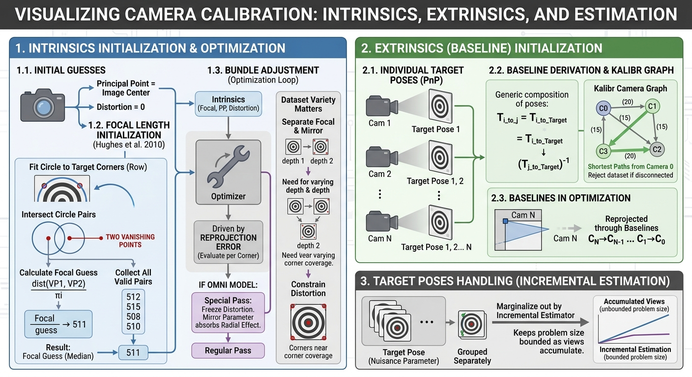

# Camera calibration: intrinsics and extrinsics

This is the first calibration you run, and everything else in this folder
builds on top of it. It answers two questions:

1. **For each camera on its own:** exactly how does its lens bend light? This
   is called its **intrinsics**.
2. **If there's more than one camera:** exactly how are they positioned
   relative to each other — how far apart, and at what angle? This is called
   the **extrinsics**, or **baseline**.

## What "intrinsics" really means

Picture a camera's intrinsics as its own personal eyeglasses prescription.
Two copies of the "same" camera model, fresh off the same assembly line,
will still have very slightly different lenses. A calibration has to measure
each individual camera, not look up a number from a spec sheet.

Concretely, intrinsics break down into a few numbers:

- **Focal length** — how zoomed-in the image is. A longer focal length means
  a narrower field of view, like a telephoto lens versus a wide-angle one.
- **Principal point** — the one pixel that sits exactly on the lens's optical
  axis. It's usually close to the image centre, but rarely exactly there.
- **Distortion** — the lens doesn't bend every ray of light by the same
  amount. Near the edges of the image, straight lines in the real world tend
  to bow inward or outward. Distortion is a small handful of numbers that
  describes exactly how much bowing to expect, and where.

## What "extrinsics" really means

If a rig carries two or more cameras bolted to the same frame, extrinsics is
simply the measurement from one camera to the next: how far away, and
rotated by how much. Think of it as a very precise ruler-and-protractor
reading between the two lenses, expressed as one combined position-and-
rotation number called a **transform**. With three or more cameras, each one
is measured relative to the previous one in a chain, camera 1 to camera 0,
camera 2 to camera 1, and so on.

## How the software actually figures this out

Nobody hand-measures any of this. Instead, you show the camera(s) a
**calibration target** — a flat board with a printed pattern whose exact
geometry is known in advance (a checkerboard, a grid of circles, or a grid of
AprilTag markers), and you take many photos of it from different distances
and angles. The software then works out backwards, from where the pattern
*appears* to land in each photo, what lens shape and camera positions would
have produced exactly that.

The diagram above is a compressed map of the whole process; here is the same
thing spelled out one step at a time.

**1. Find the pattern in every photo.** Software scans each image and picks
out the target's corners — the same job you'd do by eye playing
connect-the-dots, done automatically and refined down to a fraction of a
pixel.

**2. Make a rough first guess.** Before any fine-tuning, the software needs a
starting point that's already roughly in the right neighbourhood, or the
fine-tuning step can wander off and never find the right answer. Distortion
starts at "none," the principal point starts at the image centre, and the
focal length is estimated with a quick geometric trick: rows of the target
pattern are fitted with circles, and where two of those circles cross gives
a pair of *vanishing points*. The distance between them, scaled correctly,
is a surprisingly good first guess for how zoomed-in the lens is.

**3. Fine-tune against every photo at once.** This is the workhorse step,
usually called **bundle adjustment**. Starting from the rough guess, the
software repeatedly asks: "given my current guess for the lens shape and
each photo's camera position, where *should* each target corner land on the
sensor?" and compares that against where the corner *actually* landed. The
gap between prediction and reality is the **reprojection error**, and the
whole point of fine-tuning is to nudge every number — focal length,
principal point, distortion, and every photo's camera position — until that
gap is as small as it can be, across every corner in every photo
simultaneously.

Cameras with an unusual, very wide-angle lens shape (the "omni" model) get
one extra pass first, with distortion frozen at zero, so the lens-shape
number and the distortion numbers don't fight over the same effect before
either one is pinned down. Without that ordering, the fine-tuning can wander
indefinitely rather than settle.

**4. If there's more than one camera, work out who overlaps with whom.** The
software builds a map of which cameras see the target at the same time as
which other cameras, and how often. From that map, it plans the shortest
chain of measurements back to camera zero — if camera 2 was never in frame
at the same time as camera 0, but often shared a view with camera 1, it
measures camera 2 relative to camera 1, and camera 1 relative to camera 0,
and chains the two together. If the cameras never had *any* overlapping
view of the target with each other, there is no chain to build, and the
calibration correctly refuses to guess — this is a real, useful outcome
("your cameras never saw the target together — recapture your data so that
they do"), not a bug.

**5. Add photos gradually, and only if they help.** Rather than dumping every
photo into one enormous fine-tuning problem at once, photos are fed in one
at a time. A photo is only kept if it teaches the system something it didn't
already know — a new angle, a new distance, a corner of the frame that
hadn't been tested yet. A tenth photo of the target held in exactly the same
spot adds nothing and is politely skipped. This is what keeps calibration
practical even with a very large photo set.

**6. Throw out the bad corners.** After the rig's had a reasonable number of
photos to learn from, any single corner detection that's landed suspiciously
far from where it should be — a smudge, a shadow, a motion-blurred frame —
gets discarded, and the photos it came from are refit without it. A last
pass double-checks everything once the numbers have settled.

## What you get out, and what "good" looks like

The result is a small file (conventionally `camchain.yaml`) with one entry
per camera: its lens numbers, its distortion numbers, and — for every camera
after the first — the transform chaining it back to camera zero.

Alongside the numbers, the calibration reports its **reprojection error**:
on average, how many pixels off was the fine-tuned prediction from where the
corner was actually seen? This is the single most useful sanity check. It
should be small and, importantly, *consistent* — similar across every camera
and every photo, not tiny everywhere except one suspicious cluster of views.
A number that stays stubbornly large even after the automatic outlier
removal above usually means something structural is wrong, not that the
fine-tuning needs to try harder: a mis-measured target, a camera that isn't
actually rigid on its mount, or corners that were detected against the
wrong pattern entirely.

See [05-reading-the-results.md](05-reading-the-results.md) for more on
interpreting these numbers, including what the covariance and outlier
statistics mean and what the common red flags look like.

## Getting a good dataset

The fine-tuning step can only pin down what the photos actually demonstrate:

- **Vary the distance and angle**, not just the position. A target that's
  always held flat and square to the camera can't separate the focal length
  from the lens's own distortion — the two numbers become ambiguous with
  each other. Tilt it, and move it nearer and farther.
- **Let the target reach every corner of the frame**, not just the centre.
  Distortion is only constrained where corners have actually landed; a
  target that never reaches the edges of the image leaves the distortion
  numbers there essentially unmeasured guesswork.
- **For a multi-camera rig, make sure every camera pair shares some view of
  the target**, even indirectly through a chain. No shared view means no
  measurement is possible between them.
- **Keep the images sharp.** Motion blur and poor lighting degrade corner
  detection directly, which degrades everything downstream of it.
