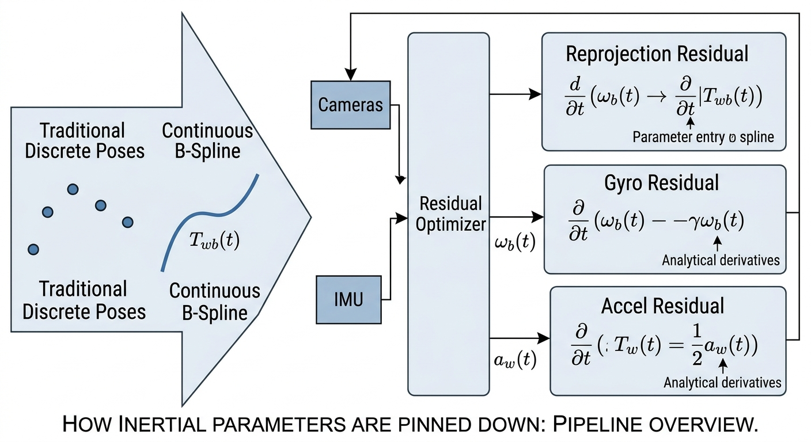
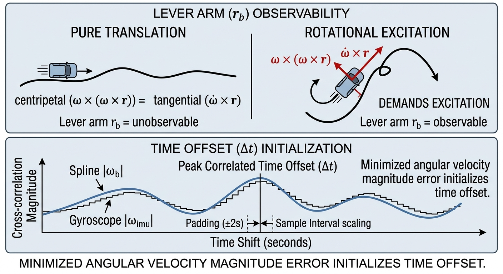
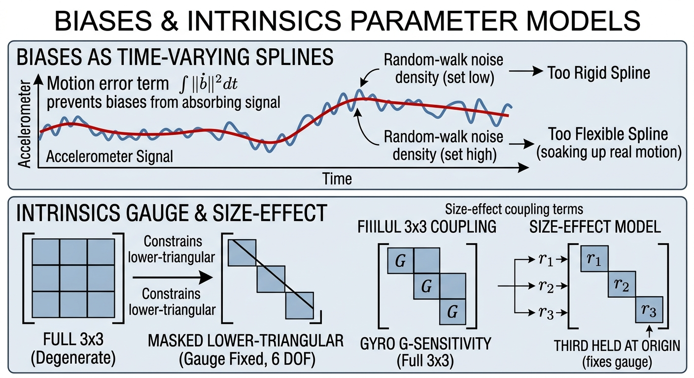
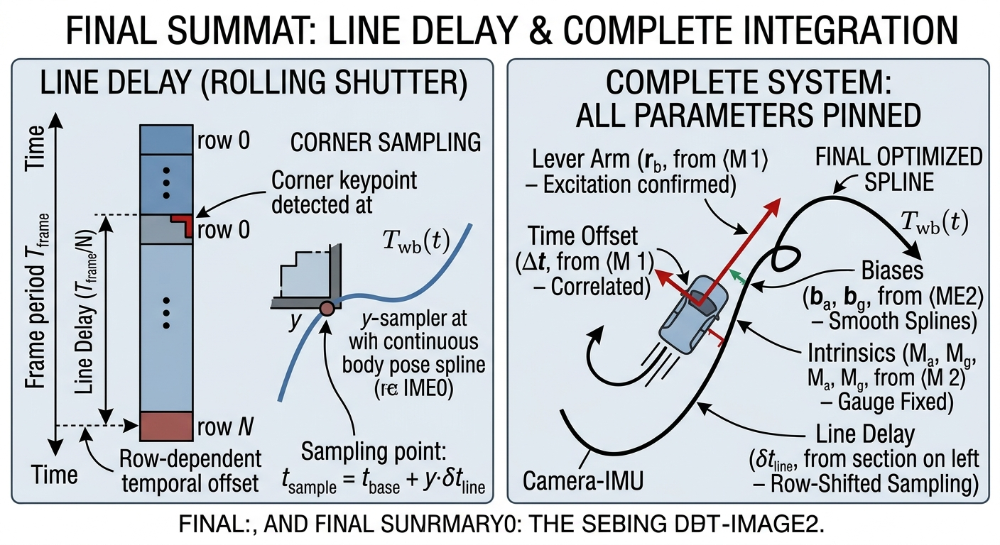

# Camera + IMU calibration

This calibration answers the question that makes visual-inertial SLAM
possible at all: exactly how does the camera's sense of "where" relate to
the IMU's sense of "how it's moving"?

It assumes camera calibration ([01-camera-calibration.md](01-camera-calibration.md))
has already been done — this step takes each camera's lens shape and
multi-camera baseline as given, and fixed.

## Why this is harder than camera calibration

A camera and an IMU disagree about almost everything:

- They **update at different rates**. A camera might deliver 20 or 30
  pictures a second; an IMU typically delivers hundreds of readings a
  second.
- They **timestamp things slightly differently**. Both devices have their
  own small, fixed processing delay before a measurement is time-stamped, so
  "the same instant" according to the camera and "the same instant"
  according to the IMU are offset by some small, unknown amount — usually a
  few milliseconds, occasionally more.
- **Neither one is mounted exactly where the other is.** They're rigidly
  attached to the same rig, but at some offset position and angle that
  nobody measured to the needed precision.
- **The IMU's own errors drift.** An accelerometer or gyroscope doesn't just
  have a fixed error — its bias wanders slowly over time, warmed up by
  temperature, vibration, and nothing in particular.

This calibration finds all four of those things at once, plus (optionally)
some finer imperfections in the IMU itself.

## The central idea: stop treating motion as a slideshow

Every other calibration in this folder can get away with treating each photo
as an independent snapshot. This one can't, because the whole point is to
compare a camera's story about the motion against an IMU's story about the
*same* motion, and the two sensors were never measuring at exactly the same
moments.

The fix is to stop thinking of the rig's motion as a series of disconnected
dots — one position per photo — and instead fit one smooth, continuous curve
through the entire trajectory, the way a flexible ruler (a French curve) can
be bent through a scatter of points to describe the whole path in one
unbroken line. Mathematically this curve is called a **B-spline**, but the
important property, for understanding what it buys you, is simpler: once you
have the curve, you can ask "where was the rig, and how fast was it turning,
at *any* instant" — including instants that fall between two camera frames,
or that line up with an IMU reading rather than a photo.

That is what the diagram above shows. Instead of a handful of separate
camera poses, one continuous curve runs through the whole motion. Both
sensors are then checked against the same curve: a camera image is compared
against where the curve says a target corner should land at that instant
(the **reprojection residual**, the same idea as in camera calibration), the
gyroscope is compared against how fast the curve is turning at that instant
(the **gyroscope residual**), and the accelerometer is compared against how
the curve is accelerating, with gravity subtracted out, at that instant (the
**accelerometer residual**). "Residual" is just the technical word for the
gap between what was measured and what the curve currently predicts —
exactly like reprojection error, but for motion instead of pixels.

Every unknown this calibration is trying to find — the camera-to-IMU
mounting offset, the timing offset, the drifting biases — only ever shows up
inside one of those three predictions. So the fine-tuning process that pins
all of them down is, underneath, the same idea as camera calibration's
bundle adjustment: keep adjusting the numbers until all three kinds of
residual shrink as much as they can, everywhere, at once.

## What gets found, one at a time

### The mounting offset (extrinsics)

The fixed position-and-rotation offset between the camera and the IMU,
usually written `T_cam_imu`. Think of it as the equivalent of the
inter-camera baseline from camera calibration, except now one of the two
"cameras" is an IMU.

A rough first guess for the rotation comes from a quick standalone step:
compare the spinning the camera-derived trajectory implies against the
spinning the gyroscope directly measured, and solve for the rotation that
best reconciles the two. Gravity's direction falls out of this step almost
for free — it's simply the average direction the accelerometer is pushed,
once rotated into a shared frame.

**Translation — how far the offset is — needs the rig to actually turn.**
This is the trickiest part of the whole calibration to build intuition for,
so it's worth dwelling on. Sit in the back seat of a car and close your
eyes. While the car drives in a straight line, however fast, you cannot
feel how far back from the driver's seat you are — every part of the car is
moving identically. Now have the car turn a corner: suddenly you feel
pulled sideways, and how hard you feel pulled depends on exactly how far you
are from the point the car is pivoting around. That sideways pull is the
only thing that reveals your distance from the pivot.

The same physics applies to the rig. The accelerometer only feels the
mounting offset through two effects — a centripetal pull and a tangential
push — and both of those effects are exactly zero under pure translation.
**A dataset that only ever slides the rig around in a straight line can run
for an hour and still never pin down the translation offset,** no matter how
much data it collects. The rig has to be rotated for this part of the
calibration to have anything to measure.

The top half of the diagram above is exactly this: pure translation (left)
gives no signal to measure the offset from; rotation (right) does.

### The timing offset

Before fine-tuning starts, a rough guess for the camera-to-IMU timing
mismatch is found the same way you'd sync two separate video and audio
recordings of a hand-clap: take the "shakiness" signature implied by the
camera's own estimated rotation, take the shakiness signature the gyroscope
recorded directly, and slide one against the other in time until they line
up as closely as possible. The amount of sliding needed at the best-aligned
position is the rough time-offset guess (the bottom half of the diagram
above shows this alignment).

That rough guess then becomes an ordinary number in the fine-tuning step,
free to adjust further: shifting it slightly changes exactly which instant
on the continuous curve a given photo gets compared against, and the
fine-tuning is free to slide it until the camera's residuals are as small as
they can be. This is also why the curve needs a little slack — a couple of
seconds of extra room — built onto each end before fine-tuning starts: so
that sliding the timing offset around doesn't run the curve off the end of
its own definition.

### The drifting biases

An accelerometer or gyroscope's bias isn't a single number to solve for —
it's a slowly wandering value that keeps changing throughout the whole
recording. So instead of one number per sensor, each bias gets its own
gentle curve, exactly like the motion trajectory itself, evaluated
throughout the recording and added into the accelerometer and gyroscope
predictions.

This creates an obvious risk: if the bias curve is allowed to bend as
freely as it likes, it can simply absorb *any* mismatch — including real
motion the rig actually experienced — the same way a rubber band stretched
through every data point stops meaning anything as a trend. To prevent that,
the bias curve is penalised for bending too fast: gentle wandering is
allowed, sharp wiggling is discouraged. Get that penalty too loose and the
bias quietly eats real signal, producing a calibration that looks clean but
is subtly wrong. Get it too tight and the bias curve can't track real,
slow sensor drift, and the error shows up elsewhere instead.

The top half of the diagram above is this trade-off: too rigid a bias curve
and it can't track real drift; too flexible and it starts absorbing motion
that should have gone into the trajectory instead.

### IMU intrinsics (optional, for finer detail)

By default the calibration only asks for the mounting offset, the timing
offset, and the biases. Two more detailed IMU models are available for rigs
that need them:

- One adds correction for the accelerometer's and gyroscope's axes not
  being perfectly at right angles to each other, and their sensitivity not
  being perfectly equal along every axis (**scale and misalignment**), plus
  a correction for the gyroscope reading being slightly influenced by strong
  acceleration (**g-sensitivity**).
- A further one adds a correction for the accelerometer's three axes not
  physically sharing the same point in space inside the chip package (the
  **size effect**), which matters only for very precise work.

These are genuinely finer corrections, and they need genuinely richer data
to pin down reliably — the g-sensitivity term, in particular, is only
measurable when the rig experiences strong acceleration *while* rotating.
The bottom half of the diagram above shows how these models are kept
well-posed: naively letting every entry of the scale-and-misalignment
correction move freely is ambiguous with the very definition of the IMU's
own coordinate frame, so entries are deliberately masked off to remove that
ambiguity, rather than left to the fine-tuning to sort out on its own.
Requesting either of these models without the motion variety they need
tends to produce numbers that look confident but are not trustworthy — see
[05-reading-the-results.md](05-reading-the-results.md).

## It all comes together in one solve

The right-hand side of the diagram above is the finished picture: every
piece discussed above — the mounting offset, the time offset, the bias
curves, and (if requested) the IMU intrinsics — is fine-tuned simultaneously
against one shared trajectory curve, not solved one at a time in isolation.
That's deliberate: these quantities interact, and solving them together is
what lets the reprojection, gyroscope and accelerometer residuals all pull
the same final answer into consistency with each other.

## What you get out, and what "good" looks like

The result includes the mounting transform between camera and IMU, the
timing offset (typically a handful of milliseconds), and the fitted bias
curves. Alongside the numbers, the calibration reports the same kind of
reprojection-error statistic as camera calibration, plus residual
statistics for the accelerometer and gyroscope — how far off, in the
sensor's own units, the fitted trajectory's predictions were from what the
IMU actually reported.

A converged run with small, consistent residuals across all three kinds of
measurement, and a mounting-offset translation that repeats closely if you
re-run the calibration on a second dataset, is the sign of a trustworthy
result. See [05-reading-the-results.md](05-reading-the-results.md) for the
full picture, including the specific trap this calibration is prone to: a
run that *looks* confident because the numbers barely moved, when really the
dataset just never gave the rig anything to be uncertain about.

## Getting a good dataset

- **Rotate the rig, deliberately and often, around all three axes** — not
  just carry it around. As explained above, translation alone cannot
  measure the mounting offset at all.
- **Keep the calibration target in view** throughout the recording; the
  trajectory curve is only tied to reality where the camera can see it.
- **Avoid a "boring" dataset.** A few minutes of energetic, varied motion —
  turns, tilts, changes of pace — is far more useful than a long, gentle,
  mostly-straight recording.
- **If requesting the advanced IMU intrinsics models,** make sure the
  dataset includes strong accelerations combined with rotation, not just
  rotation on its own.
